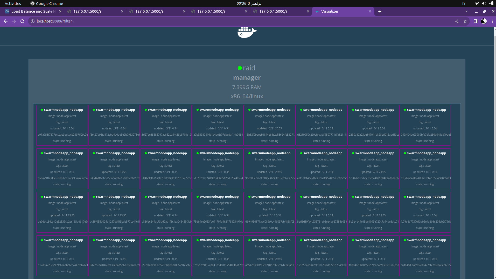

# This is a repo that contains a basic configuration for nginx as a load balancer and docker swarm as a docker orchastration

## 1. build the images :

## The app:

```bash
    docker build -t node-app .
```

## The nginx server

```bash
cd nginx && docker build -t nginx-loadbalancing  .
```

## Now init the swarm orchastration

```bash
docker swarm init
```

By running this u 'll create a manager node. For this project we will be usig only one host .Later on we can set mutlple host service communication

## Finnaly we can start the orchastration is out master host

```bash
docker stack deploy -c docker-compose.yaml swarm-app
```

1. This will create 2 services (a proxy service and node-app service .each service has a replics ,exposed ports and the image theu depend on).

2. Now that evrtyhing works oopen multiple browser tabs with the follwing url 127.0.0.1:5000(as u can see each time there is a new host)

##  Scalling :
```bash
docker service scale servicename=replicas
# exapmple:
docker service scale swarm-app_nodeapp=50
```
## Visualization :

```bash
docker container run -p 8080:8080 -v /var/run/docker.sock:/var/run/docker.sock -d dockersamples/visualizer
```
&& check localhost:8080
